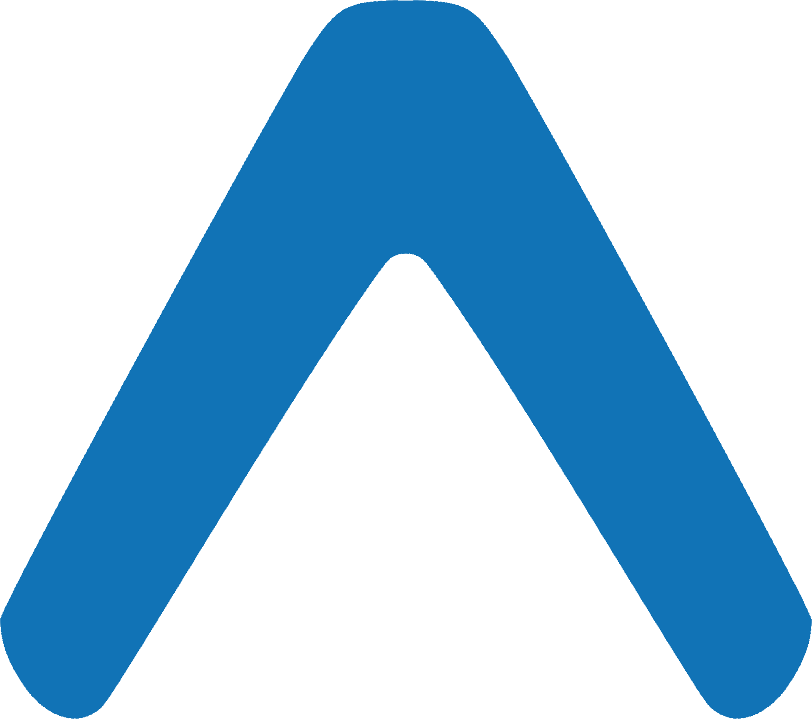

<div align="center">



# ACATEL - Material Design Commerce App

[](https://flutter.dev)
[](https://dart.dev)
[](https://m3.material.io)
[](https://codelabs.developers.google.com/codelabs/mdc-101-flutter)

A customized Flutter e-commerce application built upon Google's Material Design Components (MDC) 101-104 codelabs series, featuring ACATEL branding and Indonesian market localization.

[Features](#features) • [Getting Started](#getting-started) • [Installation](#installation) • [Codelabs Series](#codelabs-series) • [Customizations](#customizations) • [Credits](#credits)

</div>

## Overview

ACATEL is a comprehensive Flutter e-commerce application based on Google's **Material Design Components (MDC) 101-104 codelabs series**. Originally designed as "Shrine" in the Google codelabs, this version has been customized with ACATEL branding, Indonesian Rupiah currency formatting, and a curated product catalog featuring cats, dogs, and collectible Labubu figures.

This project demonstrates the complete MDC Flutter implementation journey:
- **MDC-101**: Material Components Basics (Login, TextFields, Buttons)
- **MDC-102**: Material Structure and Layout (App structure, Navigation)
- **MDC-103**: Material Theming (Colors, Typography, Shape)
- **MDC-104**: Material Advanced Components (Backdrop, Cards, Filters)

The application showcases advanced Flutter concepts including backdrop navigation, custom theming, product management, and responsive design principles taught in Google's official Material Design codelabs.

## Features

### Core Material Components (MDC Series)
- **Login Interface** (MDC-101): Material TextFields, Buttons with ink ripple effects
- **App Structure** (MDC-102): Navigation, App bars, Material layout patterns
- **Custom Theming** (MDC-103): ACATEL blue color palette, typography, elevation
- **Advanced Components** (MDC-104): Backdrop navigation, Product cards, Category filtering

### ACATEL Customizations
- **Indonesian Localization**: Full Rupiah (IDR) currency formatting with proper thousands separators
- **Multi-Category Shopping**: Browse products across Cats, Dogs, and Labubu collectibles
- **ACATEL Branding**: Custom blue theme replacing original pink/brown Shrine colors
- **Enhanced Product Catalog**: Local asset management with organized product categories
- **Responsive Design**: Optimized layouts for various mobile screen sizes

## Codelabs Series

This project follows Google's official Material Design Components Flutter codelabs:

| Codelab | Focus | Implementation Status |
|---------|-------|----------------------|
| [MDC-101](https://codelabs.developers.google.com/codelabs/mdc-101-flutter) | Material Basics | ✅ Completed with ACATEL login |
| [MDC-102](https://codelabs.developers.google.com/codelabs/mdc-102-flutter) | Structure & Layout | ✅ Completed with product catalog |
| [MDC-103](https://codelabs.developers.google.com/codelabs/mdc-103-flutter) | Material Theming | ✅ Completed with blue theme |
| [MDC-104](https://codelabs.developers.google.com/codelabs/mdc-104-flutter) | Advanced Components | ✅ Completed with backdrop navigation |

> [!TIP]
> Follow the [Google Codelabs](https://codelabs.developers.google.com/) to understand the step-by-step implementation of Material Design Components in Flutter.

## Getting Started

### Prerequisites

Before running this application, ensure you have the following installed:

- [Flutter SDK](https://flutter.dev/docs/get-started/install) (>=3.0.0)
- [Dart SDK](https://dart.dev/get-dart) (>=2.12.0)
- [Android Studio](https://developer.android.com/studio) or [VS Code](https://code.visualstudio.com/) with Flutter extensions
- [Git](https://git-scm.com/downloads)

### Installation

1. **Clone the repository**
   ```bash
   git clone https://github.com/rifk7s/material_design_components.git
   ```

2. **Install dependencies**
   ```bash
   flutter pub get
   ```

3. **Run the application**
   ```bash
   flutter run
   ```

> [!NOTE]
> This project is based on the [official Google Material Components Flutter codelabs](https://github.com/material-components/material-components-flutter-codelabs). The original Shrine app has been customized for ACATEL branding and Indonesian market requirements.

## Customizations

### From Original Shrine to ACATEL

#### Color Scheme Migration
- **Original**: Pink and brown Material theme
- **ACATEL**: Custom blue palette matching brand identity
```dart
// Original Shrine colors replaced with:
const kAcatelPrimary = Color(0xFF1976D2);
const kAcatelBlue50 = Color(0xFFE3F2FD);
// ... complete blue color system
```

#### Product Catalog Updates
- **Original**: Generic home goods and clothing
- **ACATEL**: Curated categories for Indonesian market
  - **Cats**: Feline-themed products (Rp 500.000 - Rp 1.000.000)
  - **Dogs**: Canine merchandise (Rp 1.200.000 each)  
  - **Labubu**: Collectible figures (Rp 150.000 - Rp 80.000.000)

#### Localization Enhancements
- **Currency**: Indonesian Rupiah with proper formatting
- **Typography**: Rubik font family integration
- **Asset Management**: Organized local product images

### Development Structure

```
lib/
├── app.dart              # Main app configuration (MDC-102/103)
├── main.dart             # Application entry point
├── login.dart            # Authentication interface (MDC-101)
├── home.dart             # Product display (MDC-102)
├── backdrop.dart         # Advanced navigation (MDC-104)
├── category_menu_page.dart # Category filtering (MDC-104)
├── colors.dart           # ACATEL blue theme (MDC-103)
├── model/
│   ├── product.dart      # Product data model
│   └── products_repository.dart # Product management
└── supplemental/
    ├── product_card.dart # Card components (MDC-104)
    └── product_columns.dart # Layout management
```

## Technology Stack

- **Framework**: Flutter 3.0+ (following Google codelabs standards)
- **Language**: Dart 3.0+
- **Design System**: Material Design 3 (as implemented in MDC series)
- **State Management**: Built-in Flutter state management
- **Internationalization**: `intl` package for Indonesian Rupiah formatting
- **Typography**: Rubik font family
- **Architecture**: Based on Google's MDC codelab patterns

## Credits

### Original Source
This project is based on Google's **Material Design Components (MDC) Flutter Codelabs Series**:

- **Repository**: [material-components/material-components-flutter-codelabs](https://github.com/material-components/material-components-flutter-codelabs)
- **Codelabs**: [MDC-101 through MDC-104 Flutter Series](https://codelabs.developers.google.com/codelabs/mdc-101-flutter)
- **Original App**: Shrine e-commerce application
- **Copyright**: © 2018 Google Inc.
- **License**: Apache License 2.0

### ACATEL Customizations
- **Developer**: [rifk7s](https://github.com/rifk7s)
- **Customizations**: ACATEL branding, Indonesian localization, product catalog
- **Repository**: [material_design_components](https://github.com/rifk7s/material_design_components)

## Resources

### Google Material Design
- [Material Design Guidelines](https://m3.material.io)
- [Material Components for Flutter](https://flutter.dev/docs/development/ui/widgets/material)
- [Google Codelabs - MDC Flutter Series](https://codelabs.developers.google.com/codelabs/mdc-101-flutter)

### Flutter Development
- [Flutter Documentation](https://flutter.dev/docs)
- [Dart Language Tour](https://dart.dev/guides/language/language-tour)
- [Flutter Material Library](https://api.flutter.dev/flutter/material/material-library.html)

### Contributing
Contributions are welcome! This project follows the structure established in Google's MDC codelabs. Please ensure any changes maintain compatibility with the Material Design principles taught in the original series.
